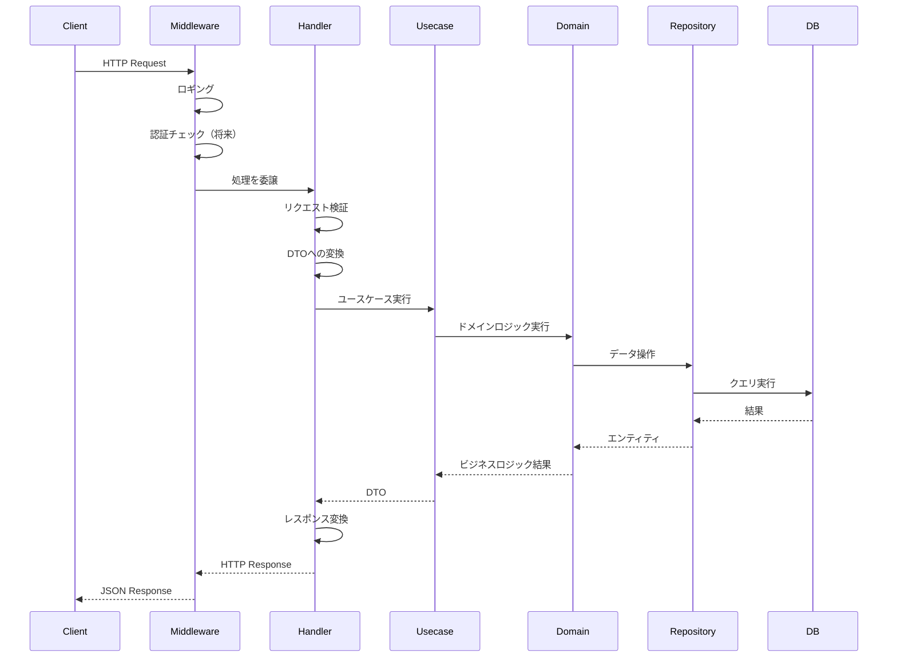
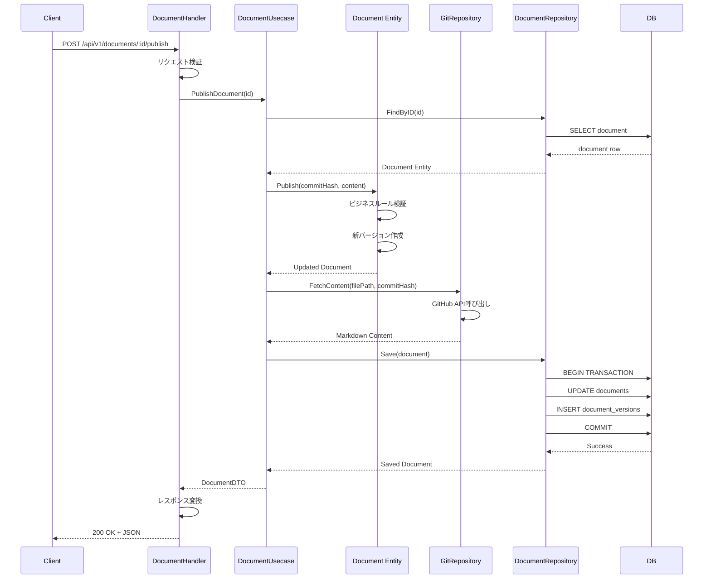
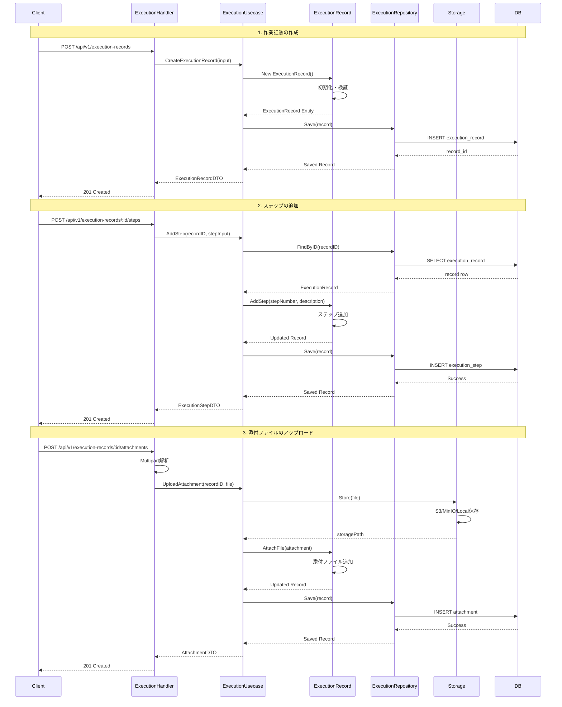
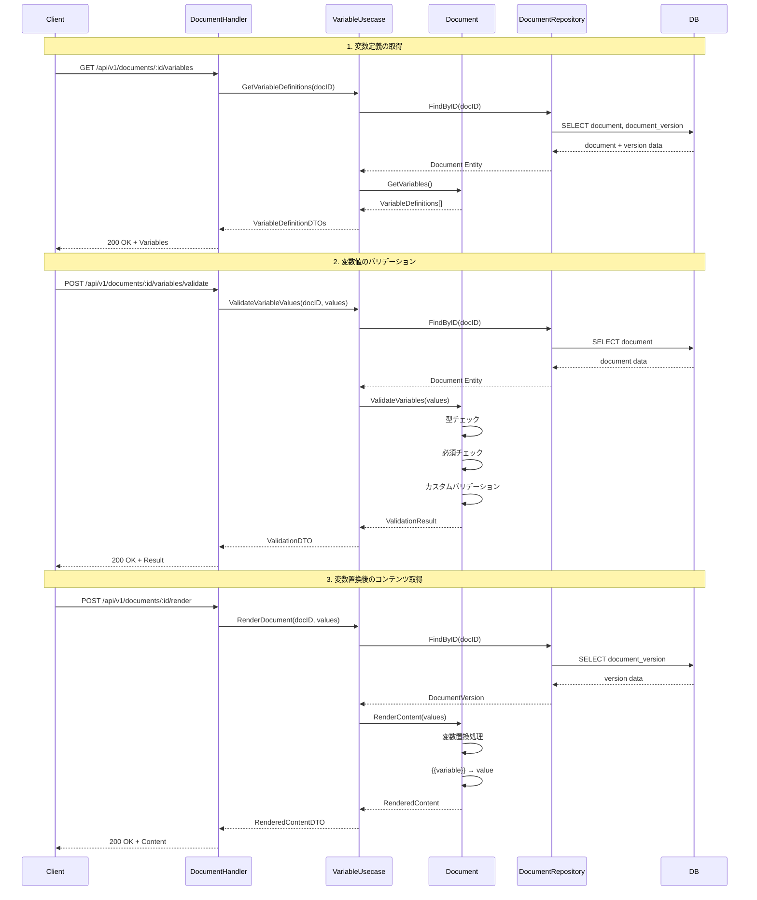
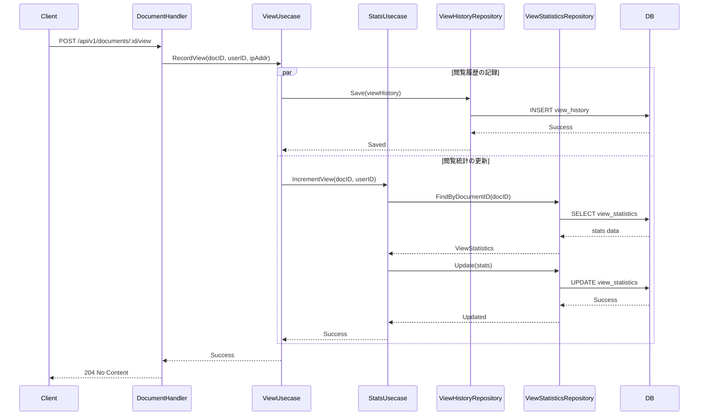
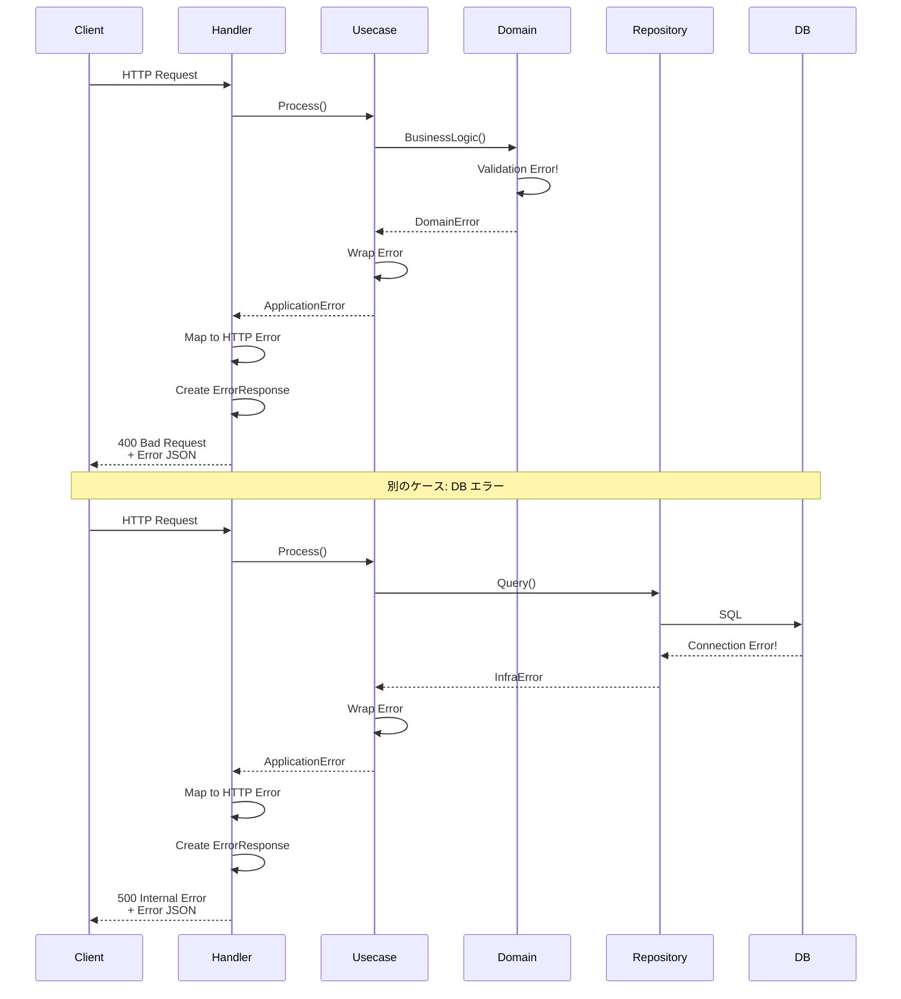
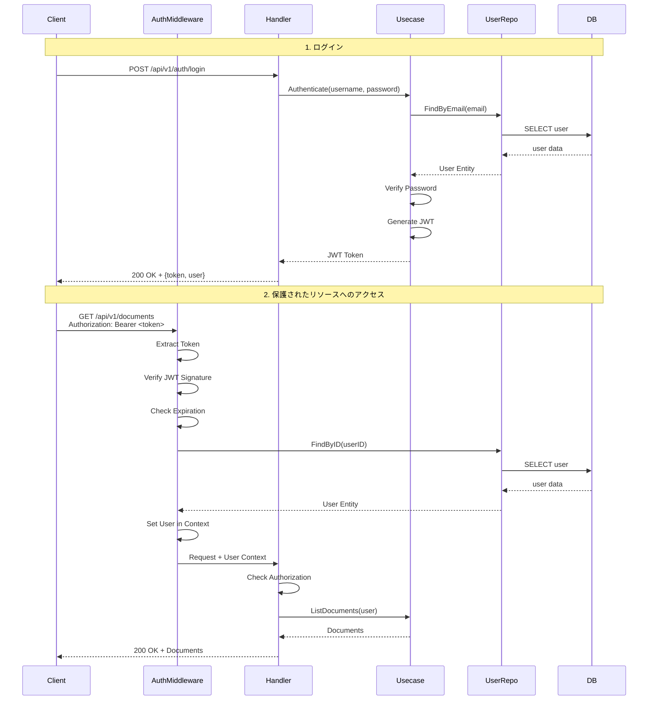

# API Processing Flow

このドキュメントでは、OpsCoreの主要なAPI処理フローについて説明します。

## 目次

- [リクエスト処理の流れ](#リクエスト処理の流れ)
- [主要APIフロー](#主要apiフロー)
- [エラーハンドリングフロー](#エラーハンドリングフロー)
- [認証・認可フロー](#認証認可フロー)

## リクエスト処理の流れ

### 基本的な処理フロー



### レイヤーの責務

| レイヤー | 責務 |
|---------|------|
| Middleware | ロギング、認証、CORS、レート制限 |
| Handler | リクエスト検証、DTO変換、エラーマッピング |
| Usecase | ユースケース実装、トランザクション管理 |
| Domain | ビジネスロジック、ドメインルール |
| Repository | データアクセス、永続化 |

## 主要APIフロー

### 1. ドキュメント公開フロー



### 2. 作業証跡記録フロー



### 3. 変数入力・レンダリングフロー



### 4. 閲覧統計フロー



## エラーハンドリングフロー

### エラー伝播の流れ



### エラーレスポンス例

```json
{
  "error": {
    "code": "VALIDATION_ERROR",
    "message": "Invalid input data",
    "details": [
      {
        "field": "title",
        "message": "title is required"
      }
    ]
  }
}
```

## 認証・認可フロー

### JWT認証フロー（将来実装）



## トランザクション管理

### トランザクション境界

```go
// Usecase層でトランザクション管理
func (u *DocumentUsecase) PublishDocument(ctx context.Context, id string) error {
    // トランザクション開始
    tx, err := u.db.BeginTx(ctx, nil)
    if err != nil {
        return err
    }
    defer tx.Rollback()

    // ビジネスロジック実行
    doc, err := u.docRepo.FindByID(ctx, tx, id)
    if err != nil {
        return err
    }

    if err := doc.Publish(); err != nil {
        return err
    }

    if err := u.docRepo.Save(ctx, tx, doc); err != nil {
        return err
    }

    // コミット
    return tx.Commit()
}
```

### トランザクション分離レベル

- **デフォルト**: READ COMMITTED
- **特殊ケース**: SERIALIZABLE（統計更新など）

## パフォーマンス最適化

### 1. N+1問題の回避

```go
// 悪い例: N+1クエリ
documents := repo.FindAll()
for _, doc := range documents {
    versions := repo.FindVersions(doc.ID) // N回のクエリ
}

// 良い例: Eager Loading
documents := repo.FindAllWithVersions() // 1回のJOINクエリ
```

### 2. ページネーション

```go
// リクエスト
GET /api/v1/documents?page=2&per_page=20

// レスポンス
{
  "documents": [...],
  "pagination": {
    "page": 2,
    "per_page": 20,
    "total": 100,
    "total_pages": 5
  }
}
```

### 3. 並行処理

```go
// Goroutineを使用した並行処理
func (u *Usecase) Process() error {
    var wg sync.WaitGroup
    errCh := make(chan error, 2)

    wg.Add(2)
    go func() {
        defer wg.Done()
        if err := u.task1(); err != nil {
            errCh <- err
        }
    }()

    go func() {
        defer wg.Done()
        if err := u.task2(); err != nil {
            errCh <- err
        }
    }()

    wg.Wait()
    close(errCh)

    for err := range errCh {
        if err != nil {
            return err
        }
    }
    return nil
}
```

## 関連ドキュメント

- [システム概要](./system-overview.md)
- [データベーススキーマ](./database-schema.md)
- [API開発ガイド](../development/API.md)
- [ADR 0015: Backend Custom Error Design](../../adr/0015-backend-custom-error-design.md)
