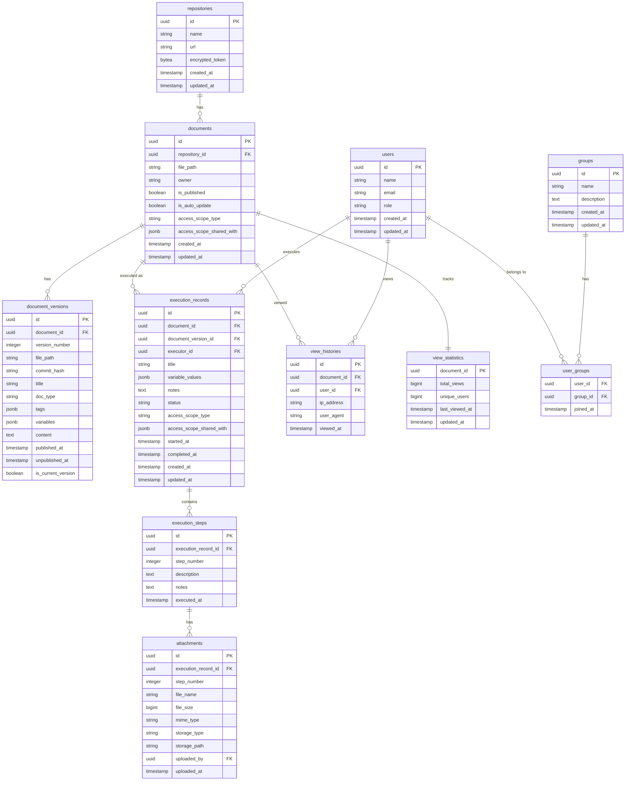

# Database Schema

このドキュメントでは、OpsCoreのデータベーススキーマについて説明します。

詳細なスキーマ定義は [ADR 0005: Database Schema](../../adr/0005-database-schema.md) を参照してください。

## 目次

- [スキーマ概要](#スキーマ概要)
- [テーブル一覧](#テーブル一覧)
- [ER図](#er図)
- [テーブル詳細](#テーブル詳細)
- [インデックス設計](#インデックス設計)

## スキーマ概要

OpsCoreのデータベースは、PostgreSQL 14+を使用し、以下のテーブルグループで構成されています：

1. **リポジトリ管理**: Gitリポジトリ情報
2. **ドキュメント管理**: ドキュメントとバージョン
3. **作業証跡管理**: 実行記録と添付ファイル
4. **ユーザー管理**: ユーザーとグループ
5. **閲覧管理**: 閲覧履歴と統計

## テーブル一覧

| テーブル名 | 説明 | レコード数（想定） |
|-----------|------|------------------|
| `repositories` | Gitリポジトリ情報 | 〜100 |
| `documents` | ドキュメント情報 | 〜10,000 |
| `document_versions` | ドキュメントバージョン履歴 | 〜100,000 |
| `execution_records` | 作業証跡 | 〜100,000 |
| `execution_steps` | 作業ステップ | 〜1,000,000 |
| `attachments` | 添付ファイル情報 | 〜500,000 |
| `users` | ユーザー情報 | 〜1,000 |
| `groups` | グループ情報 | 〜100 |
| `user_groups` | ユーザー・グループ関連 | 〜5,000 |
| `view_histories` | 閲覧履歴 | 〜1,000,000 |
| `view_statistics` | 閲覧統計 | 〜10,000 |

## ER図

### 全体ER図



## テーブル詳細

### repositories

Gitリポジトリの情報を管理。

```sql
CREATE TABLE repositories (
    id UUID PRIMARY KEY DEFAULT gen_random_uuid(),
    name VARCHAR(255) NOT NULL,
    url TEXT NOT NULL,
    encrypted_token BYTEA NOT NULL,  -- AES-256-GCM暗号化
    created_at TIMESTAMP NOT NULL DEFAULT CURRENT_TIMESTAMP,
    updated_at TIMESTAMP NOT NULL DEFAULT CURRENT_TIMESTAMP,
    UNIQUE(url)
);

CREATE INDEX idx_repositories_name ON repositories(name);
```

**主要カラム**:
- `encrypted_token`: アクセストークンを暗号化して保存

### documents

ドキュメントのメタデータと公開状態を管理。

```sql
CREATE TABLE documents (
    id UUID PRIMARY KEY DEFAULT gen_random_uuid(),
    repository_id UUID NOT NULL REFERENCES repositories(id) ON DELETE CASCADE,
    file_path TEXT NOT NULL,
    owner VARCHAR(255) NOT NULL,
    is_published BOOLEAN NOT NULL DEFAULT FALSE,
    is_auto_update BOOLEAN NOT NULL DEFAULT FALSE,
    access_scope_type VARCHAR(50) NOT NULL DEFAULT 'public',
    access_scope_shared_with JSONB,
    created_at TIMESTAMP NOT NULL DEFAULT CURRENT_TIMESTAMP,
    updated_at TIMESTAMP NOT NULL DEFAULT CURRENT_TIMESTAMP,
    UNIQUE(repository_id, file_path)
);

CREATE INDEX idx_documents_repository_id ON documents(repository_id);
CREATE INDEX idx_documents_is_published ON documents(is_published);
CREATE INDEX idx_documents_owner ON documents(owner);
```

**主要カラム**:
- `access_scope_type`: "public" または "private"
- `access_scope_shared_with`: 共有先のユーザーID・グループIDの配列（JSONB）

### document_versions

ドキュメントのバージョン履歴を管理。

```sql
CREATE TABLE document_versions (
    id UUID PRIMARY KEY DEFAULT gen_random_uuid(),
    document_id UUID NOT NULL REFERENCES documents(id) ON DELETE CASCADE,
    version_number INTEGER NOT NULL,
    file_path TEXT NOT NULL,
    commit_hash VARCHAR(255) NOT NULL,
    title VARCHAR(500) NOT NULL,
    doc_type VARCHAR(50) NOT NULL,
    tags JSONB,
    variables JSONB,
    content TEXT NOT NULL,
    published_at TIMESTAMP NOT NULL DEFAULT CURRENT_TIMESTAMP,
    unpublished_at TIMESTAMP,
    is_current_version BOOLEAN NOT NULL DEFAULT FALSE,
    UNIQUE(document_id, version_number)
);

CREATE INDEX idx_document_versions_document_id ON document_versions(document_id);
CREATE INDEX idx_document_versions_is_current ON document_versions(is_current_version);
```

**主要カラム**:
- `version_number`: ドキュメントごとに1から連番
- `variables`: 変数定義（JSONB配列）
- `is_current_version`: 現在公開中のバージョンか

### execution_records

作業証跡の基本情報を管理。

```sql
CREATE TABLE execution_records (
    id UUID PRIMARY KEY DEFAULT gen_random_uuid(),
    document_id UUID NOT NULL REFERENCES documents(id) ON DELETE CASCADE,
    document_version_id UUID NOT NULL REFERENCES document_versions(id),
    executor_id UUID NOT NULL REFERENCES users(id),
    title VARCHAR(500) NOT NULL,
    variable_values JSONB,
    notes TEXT,
    status VARCHAR(50) NOT NULL DEFAULT 'in_progress',
    access_scope_type VARCHAR(50) NOT NULL DEFAULT 'private',
    access_scope_shared_with JSONB,
    started_at TIMESTAMP NOT NULL DEFAULT CURRENT_TIMESTAMP,
    completed_at TIMESTAMP,
    created_at TIMESTAMP NOT NULL DEFAULT CURRENT_TIMESTAMP,
    updated_at TIMESTAMP NOT NULL DEFAULT CURRENT_TIMESTAMP,
    CHECK (status IN ('in_progress', 'completed', 'failed'))
);

CREATE INDEX idx_execution_records_document_id ON execution_records(document_id);
CREATE INDEX idx_execution_records_executor_id ON execution_records(executor_id);
CREATE INDEX idx_execution_records_status ON execution_records(status);
CREATE INDEX idx_execution_records_started_at ON execution_records(started_at DESC);
```

**主要カラム**:
- `variable_values`: 使用した変数値（JSONB配列）
- `status`: "in_progress", "completed", "failed"

### execution_steps

作業証跡の各ステップを管理。

```sql
CREATE TABLE execution_steps (
    id UUID PRIMARY KEY DEFAULT gen_random_uuid(),
    execution_record_id UUID NOT NULL REFERENCES execution_records(id) ON DELETE CASCADE,
    step_number INTEGER NOT NULL,
    description TEXT NOT NULL,
    notes TEXT,
    executed_at TIMESTAMP NOT NULL DEFAULT CURRENT_TIMESTAMP,
    UNIQUE(execution_record_id, step_number)
);

CREATE INDEX idx_execution_steps_execution_record_id ON execution_steps(execution_record_id);
```

### attachments

添付ファイルの情報を管理。

```sql
CREATE TABLE attachments (
    id UUID PRIMARY KEY DEFAULT gen_random_uuid(),
    execution_record_id UUID NOT NULL REFERENCES execution_records(id) ON DELETE CASCADE,
    step_number INTEGER NOT NULL,
    file_name VARCHAR(500) NOT NULL,
    file_size BIGINT NOT NULL,
    mime_type VARCHAR(100) NOT NULL,
    storage_type VARCHAR(50) NOT NULL,
    storage_path TEXT NOT NULL,
    uploaded_by UUID NOT NULL REFERENCES users(id),
    uploaded_at TIMESTAMP NOT NULL DEFAULT CURRENT_TIMESTAMP,
    CHECK (storage_type IN ('local', 's3', 'minio'))
);

CREATE INDEX idx_attachments_execution_record_id ON attachments(execution_record_id);
CREATE INDEX idx_attachments_uploaded_by ON attachments(uploaded_by);
```

**主要カラム**:
- `storage_type`: "local", "s3", "minio"
- `storage_path`: ストレージ上のファイルパス

### users

ユーザー情報を管理。

```sql
CREATE TABLE users (
    id UUID PRIMARY KEY DEFAULT gen_random_uuid(),
    name VARCHAR(255) NOT NULL,
    email VARCHAR(255) NOT NULL UNIQUE,
    role VARCHAR(50) NOT NULL DEFAULT 'user',
    created_at TIMESTAMP NOT NULL DEFAULT CURRENT_TIMESTAMP,
    updated_at TIMESTAMP NOT NULL DEFAULT CURRENT_TIMESTAMP,
    CHECK (role IN ('admin', 'user'))
);

CREATE INDEX idx_users_email ON users(email);
CREATE INDEX idx_users_role ON users(role);
```

### groups

グループ情報を管理。

```sql
CREATE TABLE groups (
    id UUID PRIMARY KEY DEFAULT gen_random_uuid(),
    name VARCHAR(255) NOT NULL UNIQUE,
    description TEXT,
    created_at TIMESTAMP NOT NULL DEFAULT CURRENT_TIMESTAMP,
    updated_at TIMESTAMP NOT NULL DEFAULT CURRENT_TIMESTAMP
);

CREATE INDEX idx_groups_name ON groups(name);
```

### user_groups

ユーザーとグループの関連を管理。

```sql
CREATE TABLE user_groups (
    user_id UUID NOT NULL REFERENCES users(id) ON DELETE CASCADE,
    group_id UUID NOT NULL REFERENCES groups(id) ON DELETE CASCADE,
    joined_at TIMESTAMP NOT NULL DEFAULT CURRENT_TIMESTAMP,
    PRIMARY KEY (user_id, group_id)
);

CREATE INDEX idx_user_groups_user_id ON user_groups(user_id);
CREATE INDEX idx_user_groups_group_id ON user_groups(group_id);
```

### view_histories

ドキュメントの閲覧履歴を記録。

```sql
CREATE TABLE view_histories (
    id UUID PRIMARY KEY DEFAULT gen_random_uuid(),
    document_id UUID NOT NULL REFERENCES documents(id) ON DELETE CASCADE,
    user_id UUID REFERENCES users(id) ON DELETE SET NULL,
    ip_address VARCHAR(45),
    user_agent TEXT,
    viewed_at TIMESTAMP NOT NULL DEFAULT CURRENT_TIMESTAMP
);

CREATE INDEX idx_view_histories_document_id ON view_histories(document_id);
CREATE INDEX idx_view_histories_user_id ON view_histories(user_id);
CREATE INDEX idx_view_histories_viewed_at ON view_histories(viewed_at DESC);
```

### view_statistics

ドキュメントの閲覧統計を集計。

```sql
CREATE TABLE view_statistics (
    document_id UUID PRIMARY KEY REFERENCES documents(id) ON DELETE CASCADE,
    total_views BIGINT NOT NULL DEFAULT 0,
    unique_users BIGINT NOT NULL DEFAULT 0,
    last_viewed_at TIMESTAMP,
    updated_at TIMESTAMP NOT NULL DEFAULT CURRENT_TIMESTAMP
);
```

## インデックス設計

### 主要なインデックス

1. **外部キーインデックス**: 全ての外部キーにインデックス作成
2. **検索条件インデックス**: 頻繁に検索されるカラム
3. **ソート用インデックス**: ORDER BY句で使用されるカラム

### パフォーマンス最適化

- **UNIQUE制約**: 一意性の保証とインデックス作成
- **部分インデックス**: 条件付きインデックス（将来検討）
- **複合インデックス**: 複数カラムの組み合わせ（将来検討）

## データ型の選択

- **UUID**: 主キーとして使用（分散環境での一意性）
- **TIMESTAMP**: タイムゾーン情報なし（アプリケーション層で管理）
- **JSONB**: 柔軟なデータ構造（変数定義、共有設定等）
- **TEXT**: 長い文字列（Markdownコンテンツ、メモ等）

## マイグレーション

詳細は [ADR 0006: Database Migration](../../adr/0006-database-migration.md) を参照してください。

マイグレーションファイルは `backend/migrations/` に配置されています。

## 関連ドキュメント

- [ADR 0004: Database Specification](../../adr/0004-database-specification.md)
- [ADR 0005: Database Schema](../../adr/0005-database-schema.md)
- [ADR 0006: Database Migration](../../adr/0006-database-migration.md)
- [システム概要](./system-overview.md)
