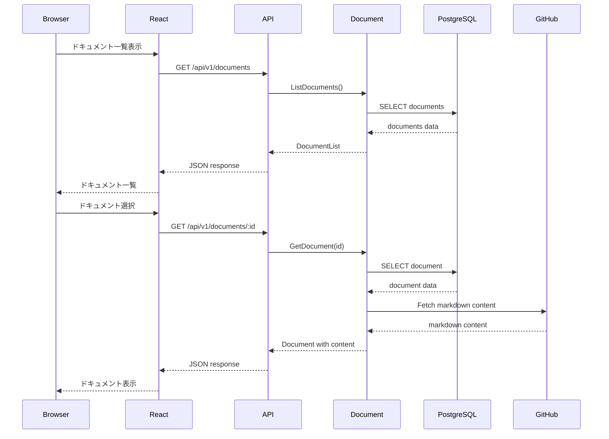
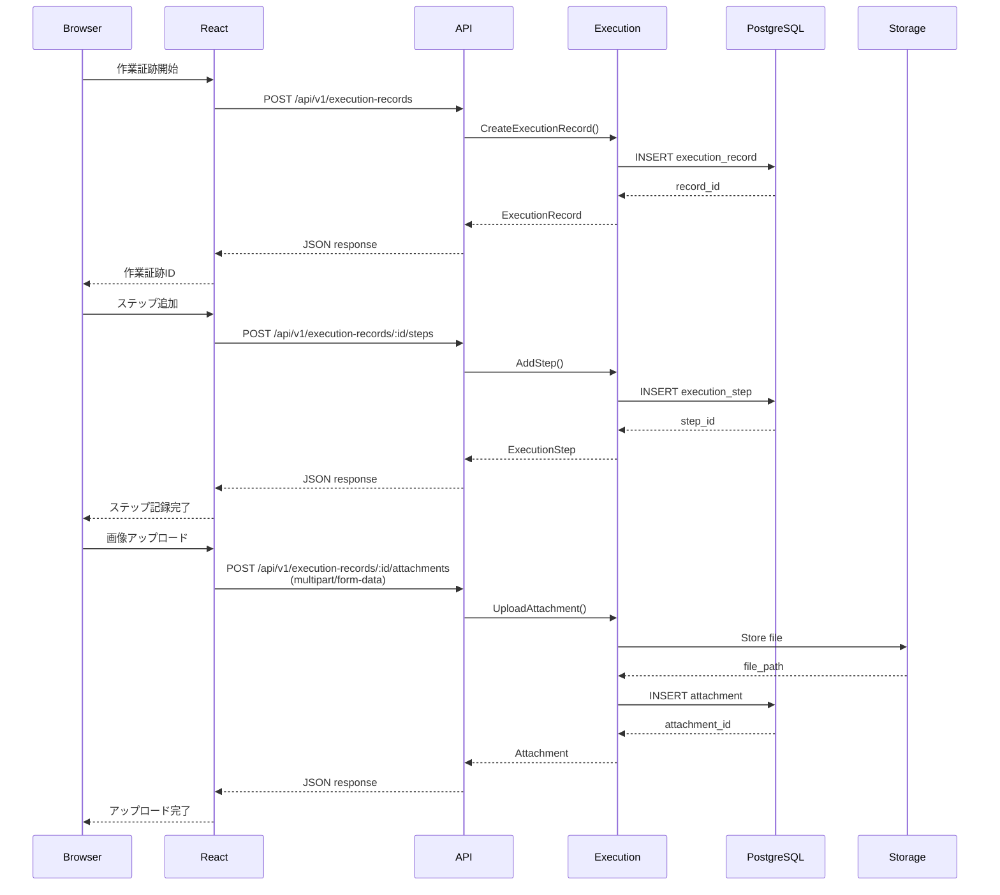
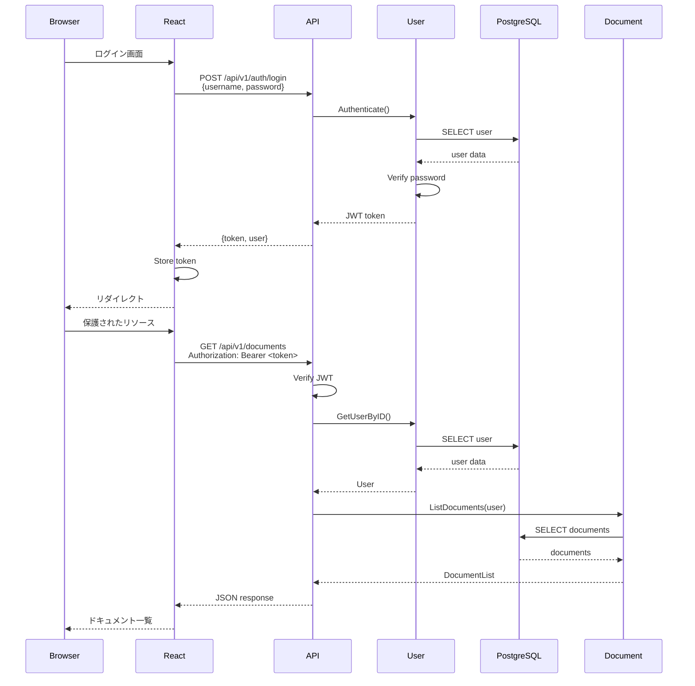
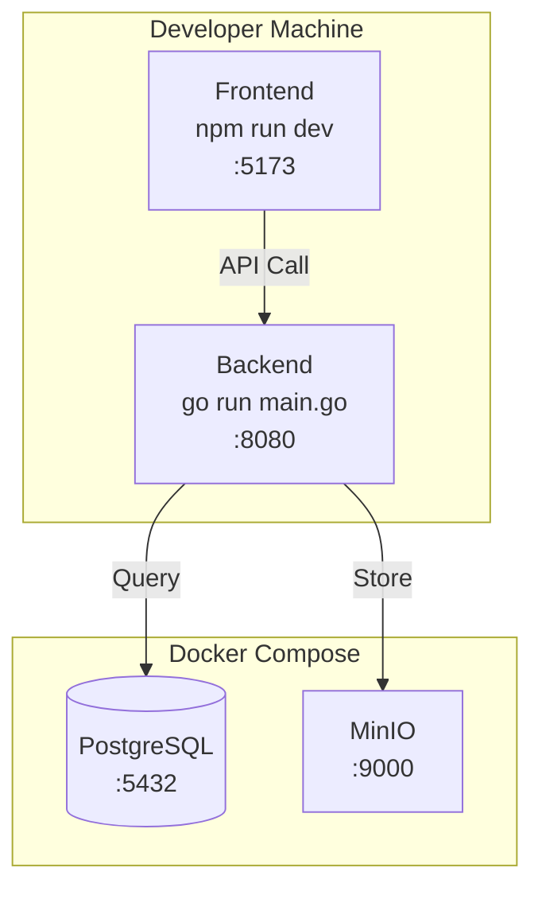
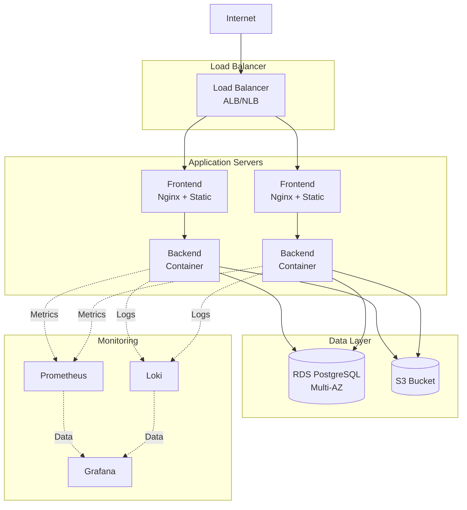

# System Overview

このドキュメントでは、OpsCoreのシステム全体のアーキテクチャと構成を説明します。

## 目次

- [システムアーキテクチャ](#システムアーキテクチャ)
- [コンポーネント構成](#コンポーネント構成)
- [データフロー](#データフロー)
- [技術スタック](#技術スタック)
- [デプロイ構成](#デプロイ構成)

## システムアーキテクチャ

### 全体構成図

```mermaid
graph TB
    subgraph "External Services"
        GitHub[GitHub/GitLab<br/>Repository]
        S3[AWS S3 /  MinIO<br/>Object Storage]
    end

    subgraph "Frontend Layer"
        Browser[Web Browser]
        React[React Application<br/>Vite + TypeScript]
    end

    subgraph "Backend Layer"
        API[API Server<br/>Go + Echo]
        
        subgraph "Domain Contexts"
            GitRepo[Git Repository<br/>Context]
            Document[Document<br/>Context]
            Execution[Execution Record<br/>Context]
            User[User<br/>Context]
            ViewStats[View Statistics<br/>Context]
        end
    end

    subgraph "Data Layer"
        PostgreSQL[(PostgreSQL<br/>Database)]
        Storage[File Storage<br/>Local/S3/MinIO]
    end

    Browser -->|HTTP/HTTPS| React
    React -->|REST API| API
    API -->|Query/Command| GitRepo
    API -->|Query/Command| Document
    API -->|Query/Command| Execution
    API -->|Query/Command| User
    API -->|Query/Command| ViewStats
    
    GitRepo -->|Fetch Files| GitHub
    Document -->|Read/Write| PostgreSQL
    Execution -->|Read/Write| PostgreSQL
    Execution -->|Upload/Download| Storage
    User -->|Read/Write| PostgreSQL
    ViewStats -->|Read/Write| PostgreSQL
    
    Storage -->|Store Objects| S3
    
    style React fill:#61dafb
    style API fill:#00add8
    style PostgreSQL fill:#336791
    style GitHub fill:#181717
    style S3 fill:#ff9900
```



## コンポーネント構成

### フロントエンド

#### React Application

- **技術**: React 18 + TypeScript + Vite
- **状態管理**: React Hooks（useState, useEffect）
- **ルーティング**: React Router
- **UIライブラリ**: カスタムコンポーネント

**主要ページ**:
```
/                           ホーム
/repositories               リポジトリ一覧
/documents                  ドキュメント一覧
/documents/:id              ドキュメント詳細
/execution-records          作業証跡一覧
/execution-records/:id      作業証跡詳細
/users                      ユーザー管理（管理者のみ）
/groups                     グループ管理（管理者のみ）
```

### バックエンド

#### API Server（Go + Echo）

- **アーキテクチャ**: Onion Architecture
- **パターン**: DDD（Domain-Driven Design）
- **コンテキスト分割**: 6つの境界づけられたコンテキスト

#### コンテキスト一覧

1. **Git Repository Context**
   - 外部Gitリポジトリとの連携
   - ファイル一覧の取得
   - アクセストークンの暗号化管理

2. **Document Context**
   - ドキュメントのライフサイクル管理
   - バージョン管理
   - 変数定義管理
   - アクセス制御

3. **Execution Record Context**
   - 作業証跡の記録
   - ステップ管理
   - 添付ファイル管理

4. **User Context**
   - ユーザー管理
   - グループ管理
   - 認証・認可（将来実装）

5. **View History Context**
   - 閲覧履歴の記録

6. **View Statistics Context**
   - 閲覧統計の集計

#### レイヤー構成

```
Context/
├── domain/              # ドメイン層
│   ├── entity/         # エンティティ
│   ├── value_object/   # 値オブジェクト
│   ├── repository/     # リポジトリインターフェース
│   └── error/          # ドメインエラー
├── application/        # アプリケーション層
│   ├── usecase/        # ユースケース
│   ├── dto/            # DTO
│   └── error/          # アプリケーションエラー
├── infrastructure/     # インフラストラクチャ層
│   └── persistence/    # データベース実装
└── interfaces/         # インターフェース層
    └── api/
        ├── handlers/   # HTTPハンドラー
        └── schema/     # APIスキーマ
```

### データベース

#### PostgreSQL

- **バージョン**: 14+
- **用途**: 構造化データの永続化
- **主要テーブル**: 17テーブル

**テーブルグループ**:
```
- リポジトリ管理: repositories
- ドキュメント管理: documents, document_versions
- 作業証跡: execution_records, execution_steps, attachments
- ユーザー管理: users, groups, user_groups
- 閲覧管理: view_histories, view_statistics
```

### ストレージ

#### ファイルストレージ

- **ローカル**: 開発環境向け
- **AWS S3**: 本番環境向け
- **MinIO**: オンプレミス環境向け

**保存データ**:
- 作業証跡の画面キャプチャ
- 添付ファイル

## データフロー

### ドキュメント閲覧フロー



### 作業証跡記録フロー



### 認証フロー（将来実装）



## 技術スタック

### フロントエンド

| カテゴリ | 技術 | 用途 |
|---------|------|------|
| フレームワーク | React 18 | UI構築 |
| 言語 | TypeScript | 型安全な開発 |
| ビルドツール | Vite | 高速な開発環境 |
| ルーティング | React Router | SPA routing |
| テスト | Vitest + RTL | 単体・統合テスト |
| リンター | ESLint | コード品質 |

### バックエンド

| カテゴリ | 技術 | 用途 |
|---------|------|------|
| 言語 | Go 1.21+ | API実装 |
| フレームワーク | Echo v4 | Webフレームワーク |
| DI | Wire | 依存性注入 |
| ORM | pgx | PostgreSQLクライアント |
| ロギング | zap | 構造化ロギング |
| マイグレーション | golang-migrate | DBマイグレーション |
| API仕様 | swaggo | OpenAPI/Swagger |
| テスト | testify | アサーション |

### インフラストラクチャ

| カテゴリ | 技術 | 用途 |
|---------|------|------|
| データベース | PostgreSQL 14+ | 構造化データ |
| ストレージ | S3/MinIO | オブジェクトストレージ |
| コンテナ | Docker | アプリケーション実行環境 |
| オーケストレーション | Docker Compose | 開発環境 |
| 監視 | Prometheus/Grafana | メトリクス監視 |
| ログ | Loki | ログ集約 |

## デプロイ構成

### 開発環境



### 本番環境（想定）



### Kubernetesデプロイ（将来）

```mermaid
graph TB
    subgraph "Kubernetes Cluster"
        subgraph "Ingress"
            Ingress[Ingress Controller]
        end

        subgraph "Frontend"
            FrontendDep[Frontend Deployment<br/>3 replicas]
            FrontendSvc[Frontend Service]
        end

        subgraph "Backend"
            BackendDep[Backend Deployment<br/>3 replicas]
            BackendSvc[Backend Service]
        end

        subgraph "Data"
            PostgresStateful[PostgreSQL StatefulSet]
            PostgresService[PostgreSQL Service]
            PVC[Persistent Volume Claims]
        end
    end

    subgraph "External Services"
        S3External[AWS S3]
    end

    Internet --> Ingress
    Ingress --> FrontendSvc
    FrontendSvc --> FrontendDep
    FrontendDep --> BackendSvc
    BackendSvc --> BackendDep
    BackendDep --> PostgresService
    PostgresService --> PostgresStateful
    PostgresStateful --> PVC
    BackendDep --> S3External
```

## スケーラビリティ

### 水平スケーリング

- **フロントエンド**: 複数インスタンスの起動（ステートレス）
- **バックエンド**: 複数インスタンスの起動（ステートレス）
- **データベース**: Read Replicaの追加

### 垂直スケーリング

- **バックエンド**: CPUとメモリの増強
- **データベース**: インスタンスサイズの拡大

### キャッシング戦略（将来実装）

- **CDN**: フロントエンドの静的ファイル
- **Redis**: セッション情報、頻繁にアクセスされるデータ
- **アプリケーションレベル**: インメモリキャッシュ

## セキュリティ

### ネットワークセキュリティ

- **HTTPS**: TLS 1.2以上
- **ファイアウォール**: 必要なポートのみ開放
- **VPC**: プライベートネットワーク

### アプリケーションセキュリティ

- **認証**: JWT（将来実装）
- **認可**: RBAC（Role-Based Access Control）
- **入力検証**: バリデーション層での実施
- **暗号化**: アクセストークンの暗号化（AES-256-GCM）

### データセキュリティ

- **データベース**: SSL/TLS接続
- **ストレージ**: サーバーサイド暗号化
- **バックアップ**: 暗号化されたバックアップ

## パフォーマンス

### 目標値

| メトリクス | 目標値 |
|-----------|--------|
| API応答時間（95パーセンタイル） | < 2秒 |
| ページロード時間 | < 3秒 |
| スループット | > 100 req/s |
| エラー率 | < 1% |

### 最適化戦略

1. **データベースクエリ**: インデックス最適化
2. **N+1問題**: Eager Loading
3. **ファイルサイズ**: 圧縮と最適化
4. **並行処理**: Goroutineの活用

## 関連ドキュメント

- [データベーススキーマ](./database-schema.md)
- [API処理フロー](./api-flow.md)
- [バックエンドアーキテクチャ](../../backend/README.md)
- [デプロイガイド](../deployment/README.md)
