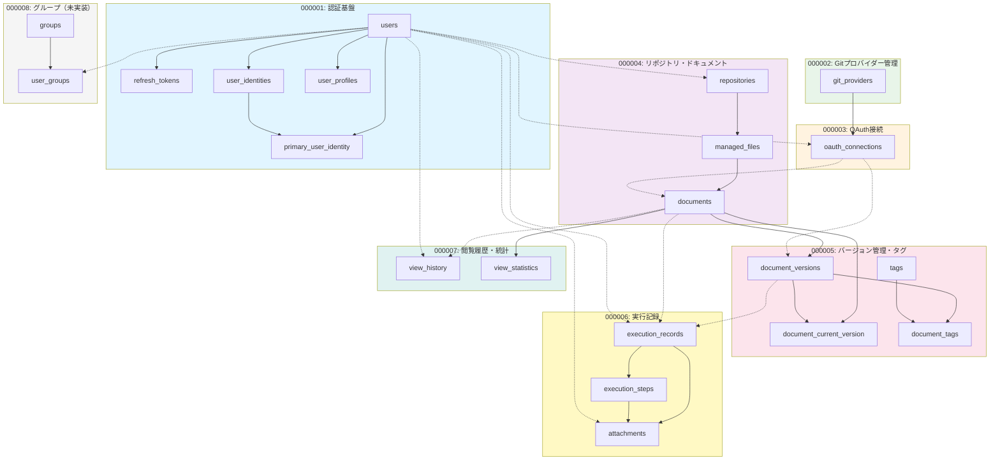
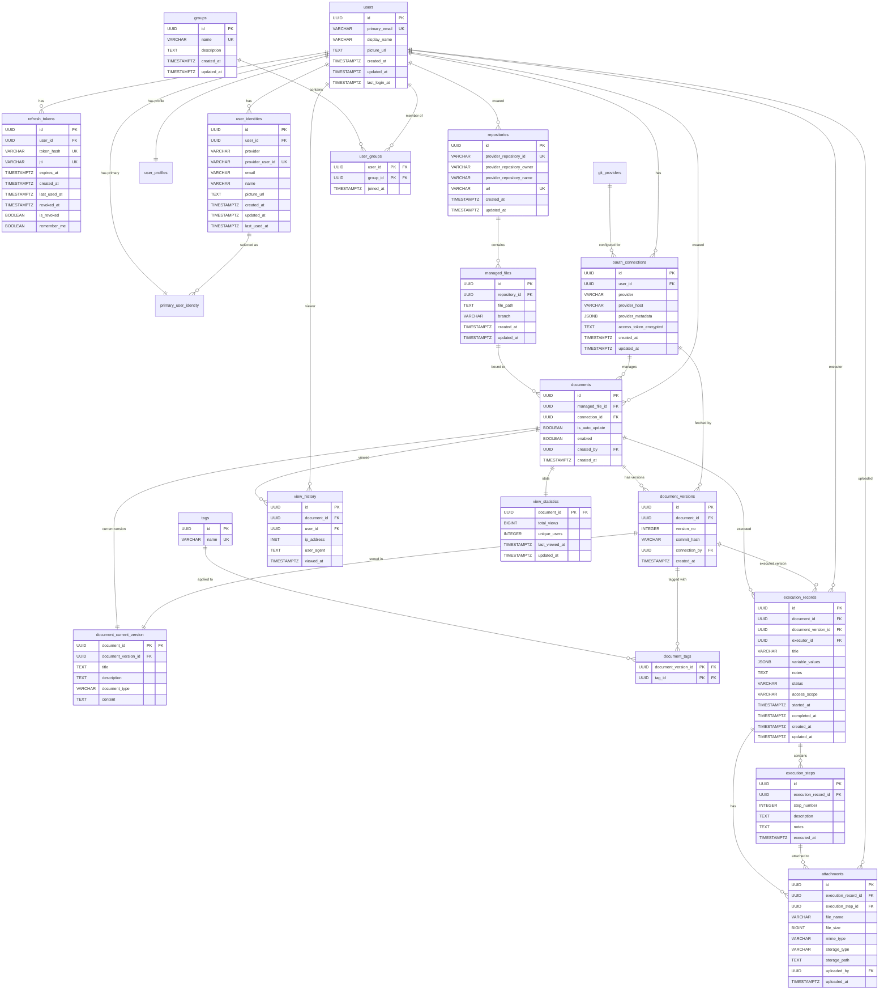
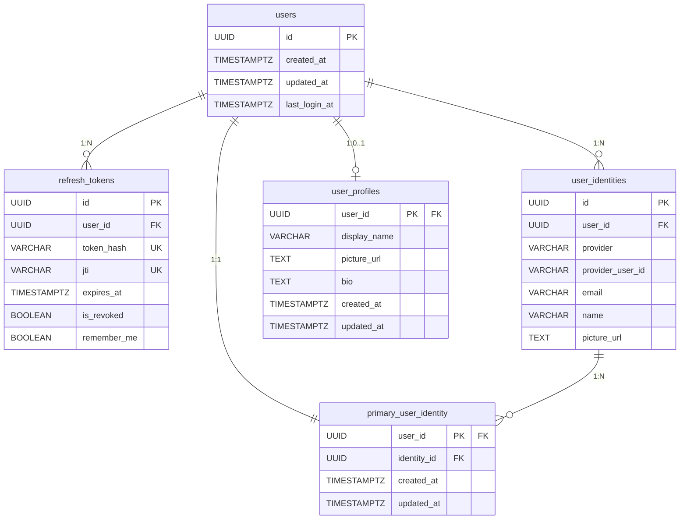
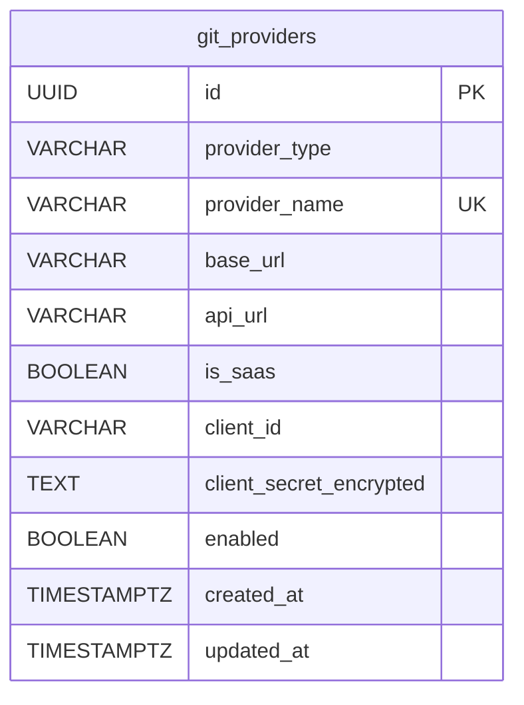
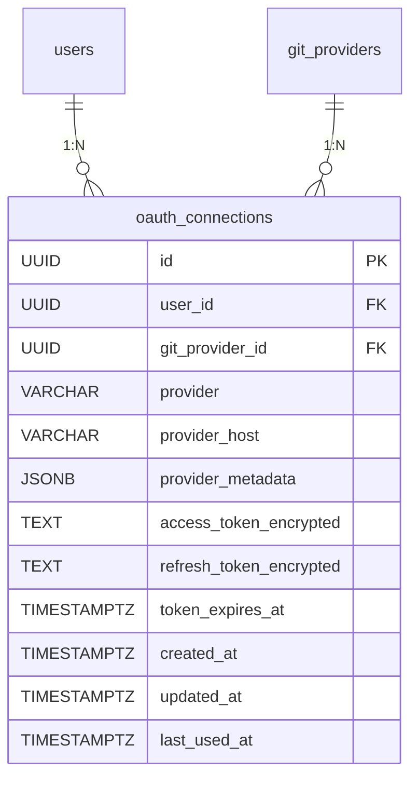
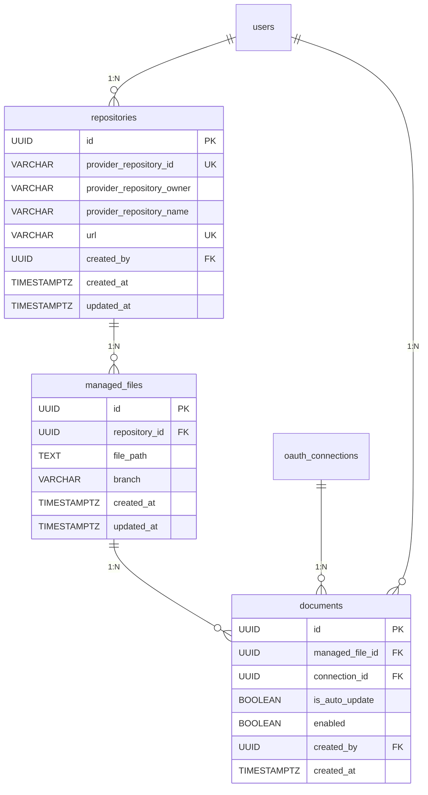
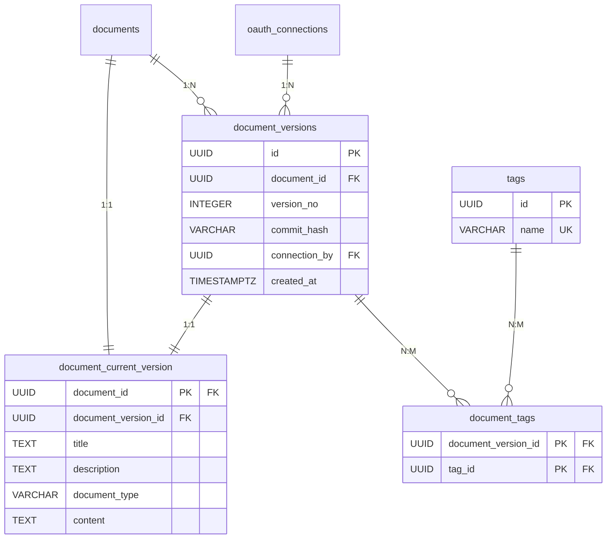
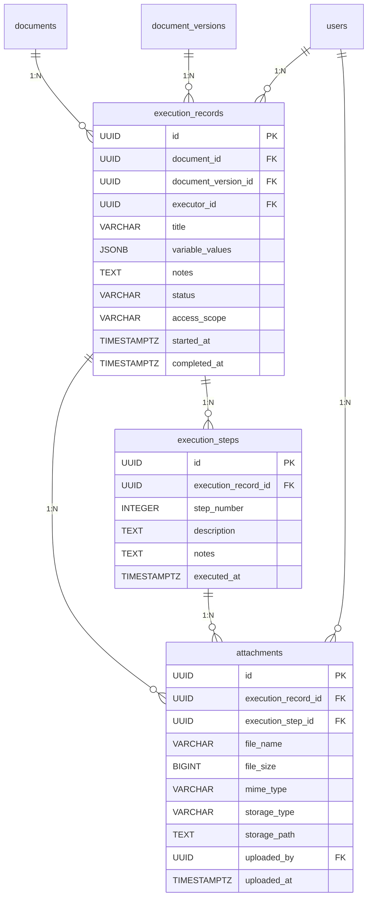
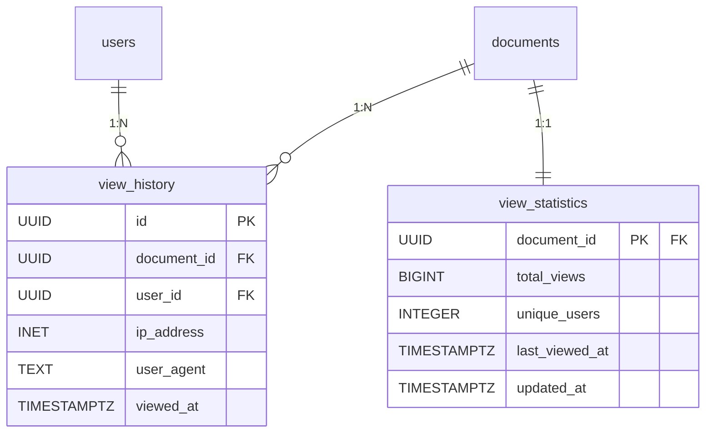
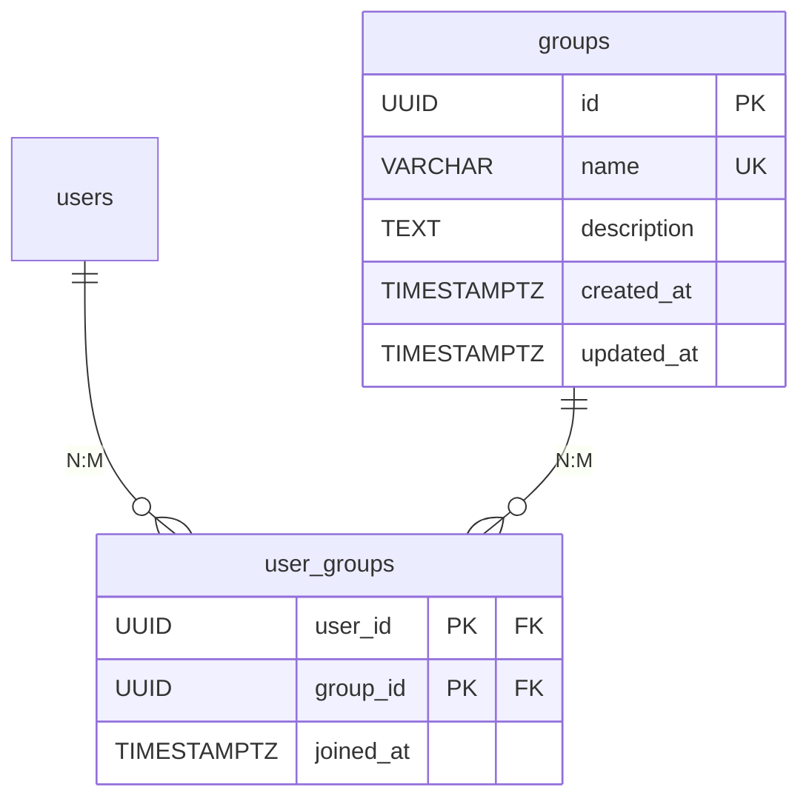

# データベースER図

現在のマイグレーションファイル (000001〜000008) から生成したER図です。

## ER図全体（マイグレーション順）



**凡例**:
- 実線矢印 (→): 同じマイグレーション内の外部キー関係
- 点線矢印 (-.->): 前のマイグレーションで定義されたテーブルへの外部キー関係

## リレーション詳細図



## 領域別ER図（詳細）

### 1. 認証・認可システム（000001）



### 2. Gitプロバイダー管理（000002）



### 3. OAuth接続管理（000003）



### 4. リポジトリ・ファイル管理（000004）



### 5. ドキュメントバージョン管理（000005）



### 6. 実行記録システム（000006）
    documents {
        UUID id PK
        UUID managed_file_id FK
        UUID connection_id FK
        BOOLEAN is_auto_update
        BOOLEAN enabled
        UUID created_by FK
        TIMESTAMPTZ created_at
    }
    
    document_versions {
        UUID id PK
        UUID document_id FK
        INTEGER version_no
        VARCHAR commit_hash
        UUID connection_by FK
        TIMESTAMPTZ created_at
    }
    
    document_current_version {
        UUID document_id PK "FK"
        UUID document_version_id FK
        TEXT title
        TEXT description
        VARCHAR document_type
        TEXT content
    }
    
    tags {
        UUID id PK
        VARCHAR name UK
    }
    
    document_tags {
        UUID document_version_id PK "FK"
        UUID tag_id PK "FK"
    }
```

### 6. 実行記録システム（000006）



### 7. 閲覧履歴・統計システム（000007）
    }
    
    attachments {
        UUID id PK
        UUID execution_record_id FK
        UUID execution_step_id FK
        VARCHAR file_name
        BIGINT file_size
        VARCHAR mime_type
        VARCHAR storage_type
        TEXT storage_path
        UUID uploaded_by FK
        TIMESTAMPTZ uploaded_at
    }
```

### 7. 閲覧履歴・統計システム（000007）



### 8. グループ管理（000008）- 未実装



## テーブル一覧

| #   | テーブル名               | 用途                                     | マイグレーション |
| --- | ------------------------ | ---------------------------------------- | ---------------- |
| 1   | users                    | ユーザー管理（認証のみ）                 | 000001           |
| 2   | refresh_tokens           | リフレッシュトークン管理                 | 000001           |
| 3   | user_identities          | 外部プロバイダー認証                     | 000001           |
| 4   | user_profiles            | ユーザープロフィール（カスタマイズ可能） | 000001           |
| 5   | primary_user_identity    | デフォルトidentity選択                   | 000001           |
| 6   | git_providers            | Gitプロバイダー設定                      | 000002           |
| 7   | oauth_connections        | OAuth接続管理                            | 000003           |
| 8   | repositories             | リポジトリ管理                           | 000004           |
| 9   | managed_files            | 管理対象ファイル                         | 000004           |
| 10  | documents                | ドキュメント論理管理                     | 000004           |
| 11  | document_versions        | ドキュメントバージョン管理               | 000005           |
| 12  | document_current_version | ドキュメント最新バージョン               | 000005           |
| 13  | tags                     | タグマスター                             | 000005           |
| 14  | document_tags            | ドキュメント・タグ中間テーブル           | 000005           |
| 15  | execution_records        | 実行記録                                 | 000006           |
| 16  | execution_steps          | 実行ステップ                             | 000006           |
| 17  | attachments              | 添付ファイル                             | 000006           |
| 18  | view_history             | 閲覧履歴                                 | 000007           |
| 19  | view_statistics          | 閲覧統計                                 | 000007           |
| 20  | groups                   | グループ管理                             | 000008（未実装） |
| 21  | user_groups              | ユーザー・グループ中間テーブル           | 000008（未実装） |

**合計: 21テーブル**
