# ドキュメント管理コンテキスト

このコンテキストでは、Ops-Coreにおけるドキュメント管理に関連する要件や機能を整理します。具体的には、以下のような内容が含まれます。

## ドキュメント管理概要

ドキュメント管理は、Ops-Coreにおけるドキュメントのライフサイクル全般を管理するための機能です。  
主に、Gitリポジトリ内のMarkdownファイルを対象に、登録・管理・公開・非公開設定・バージョン管理・検索・フィルタリング・閲覧履歴管理などの機能を提供します。

### 想定ユーザー

- ドキュメント管理者
- 開発者
- QAエンジニア
- プロジェクトマネージャー

### ユースケース一覧

#### リポジトリ管理

1. **Gitリポジトリの登録**
   - 管理対象のGitリポジトリ情報（URL, 名前, アクセストークン等）を新規登録する
2. **Gitリポジトリ情報の更新**
   - 登録済みリポジトリの情報（名前、アクセストークン等）を編集・更新する
3. **Gitリポジトリの削除**
   - 不要になったリポジトリ情報を削除する
4. **Gitリポジトリ一覧の参照**
   - 登録済みリポジトリの一覧を確認する

#### ドキュメント管理

1. **公開対象ファイルの登録・管理**
   - リポジトリ内のMarkdownファイルをWebサイト形式で公開する対象として登録・管理できる。公開対象とするMarkdownファイルには、タグ・カテゴリ・タイトル等のメタ情報が必須（メタ情報がないファイルは管理対象外）。ファイル単位で指定し、最近作成・更新されたファイルを簡単に選択できる仕組みも提供する。
2. **公開対象ファイルの一覧・履歴参照**
   - 現在公開中のファイル一覧や、公開・非公開の履歴（コミット番号・独自バージョン・公開/非公開日時）を参照できる。公開・非公開の変更は即時反映され、履歴として記録される。
3. **公開対象ファイルの非公開化・公開範囲設定**
   - 公開中のファイルを即時非公開にでき、履歴として残る。Markdownファイルごとに公開範囲（全体/特定ユーザー/グループ）も設定可能。
4. **公開ドキュメントのバージョン管理**
   - 公開ドキュメントのコミット番号と独自バージョン（ファイルごとに1から連番）を紐づけて管理できる。過去バージョンへのロールバック時、公開状態は現状を維持する。
5. **公開ドキュメントの反映タイミング制御**
   - 手動反映・自動反映（自動アップデート設定時、対象ファイルの新規コミットで自動公開し、メタ情報の変更も反映）をファイル単位で選択できる。
6. **手順書・ナレッジの検索・フィルタリング**
   - タイトル・内容・タグ・カテゴリなどで手順書やナレッジを検索・絞り込みできる。

#### 閲覧管理

1. **閲覧履歴管理**
   - ログインユーザーは閲覧履歴から手順書を簡単に再表示できる。未ログインユーザーはIPアドレス・User-Agentなどのリクエスト元情報のみ記録する。
2. **閲覧統計の表示**
   - ファイルごとの参照数、ユニークユーザー数、最終閲覧日時などの統計情報を表示できる。

#### 手順書実行と作業証跡

1. **変数入力と手順書表示**
   - 手順書に定義された変数（サーバー名、パスなど）を左ペインの入力フォームで入力し、変数が置き換えられた状態でドキュメントを表示する。変数はtype（string/number/boolean/date）、required、defaultValueなどの属性を持つ。
2. **作業証跡の作成**
   - 手順書実行時に、実行セッション単位で作業証跡を作成する。作業証跡には、実行日時、実行者、使用した変数値、作業メモ、各ステップの実行記録を含む。
3. **作業ステップの記録と画面キャプチャ添付**
   - 各作業ステップに対して、メモや画面キャプチャ（画像ファイル）を添付できる。画像はローカルファイルシステムまたはS3/MinIOなどのオブジェクトストレージに保存可能。
4. **作業証跡の完了・失敗マーク**
   - 作業証跡のステータスを「進行中」「完了」「失敗」で管理できる。
5. **作業証跡の共有**
   - 作業証跡は、実行者と管理者が閲覧できる。加えて、特定のユーザーやグループに共有可能。
6. **作業証跡の検索・フィルタリング**
   - 手順書名、実行者、実行日時、ステータス、使用した変数値などで作業証跡を検索・フィルタリングできる。

#### ユーザー・グループ管理

1. **ユーザー管理**
   - ユーザーの作成、更新、削除、一覧表示が可能。ユーザーには管理者（admin）と一般ユーザー（user）のロールがある。
2. **グループ管理**
   - グループの作成、更新、削除、一覧表示が可能。グループにユーザーを追加・削除できる。
3. **グループへの参加・脱退**
   - ユーザーは自身でグループに参加・脱退できる（または管理者が制御）。

## ドメインモデル設計

### 設計原則

- DDDの戦術的パターンに基づき、エンティティと値オブジェクトを明確に分離
- エンティティは識別子を持ち、ライフサイクルを通じて同一性を保つ
- 値オブジェクトは不変で、値の等価性で比較される
- 集約ルートを通じてのみ内部エンティティにアクセス

### 値オブジェクト（Value Objects）

#### ID系

- **RepositoryID**: リポジトリの一意識別子（UUID）
- **DocumentID**: ドキュメントの一意識別子（UUID）
- **VersionID**: バージョンの一意識別子（UUID）
- **ExecutionRecordID**: 作業証跡の一意識別子（UUID）
- **UserID**: ユーザーの一意識別子（UUID）
- **GroupID**: グループの一意識別子（UUID）
- **AttachmentID**: 添付ファイルの一意識別子（UUID）

#### ドメイン固有の値オブジェクト

- **RepositoryURL**: リポジトリURL（バリデーション付き）
- **AccessToken**: アクセストークン（暗号化・マスキング機能）
- **FilePath**: ファイルパス（相対パス、バリデーション付き）
- **CommitHash**: Gitコミットハッシュ
- **DocumentType**: ドキュメント種別（"procedure" | "knowledge"）
- **Tag**: タグ（文字数制限、正規化）
- **Category**: カテゴリ（文字数制限、正規化）
- **VersionNumber**: バージョン番号（ファイルごとに1から連番）
- **VariableDefinition**: 変数定義
  - name: string
  - label: string
  - description: string
  - type: "string" | "number" | "boolean" | "date"
  - required: boolean
  - defaultValue: string
- **VariableValue**: 変数の入力値
  - name: string
  - value: string
- **AccessScope**: アクセス範囲
  - type: "private" | "shared"
  - sharedWith: [UserID | GroupID]
- **StorageType**: ストレージタイプ（"local" | "s3" | "minio"）
- **IPAddress**: IPアドレス
- **UserAgent**: ユーザーエージェント

#### 日時系

- **DateTime**: 日時（タイムゾーン考慮）

### エンティティ（Entities）

#### Repository（集約ルート）

リポジトリの情報を管理する集約ルート。

**属性:**

- id: RepositoryID
- name: string
- url: RepositoryURL
- accessToken: AccessToken
- createdAt: DateTime
- updatedAt: DateTime

**振る舞い:**

- UpdateInfo(name, accessToken): リポジトリ情報を更新
- Delete(): リポジトリを削除（ソフトデリート）

---

#### Document（集約ルート）

公開ドキュメントを管理する集約ルート。リポジトリ内のMarkdownファイルを表す。

**属性:**

- id: DocumentID
- repositoryId: RepositoryID
- filePath: FilePath
- title: string
- owner: string
- type: DocumentType
- tags: [Tag]
- category: Category
- variables: [VariableDefinition]
- isPublished: boolean
- isAutoUpdate: boolean（自動更新設定）
- accessScope: AccessScope
- currentVersion: DocumentVersion（現在公開中のバージョン）
- versions: [DocumentVersion]（全バージョン履歴）
- createdAt: DateTime
- updatedAt: DateTime

**振る舞い:**

- Publish(commitHash, content): ドキュメントを公開し、新しいバージョンを作成
- Unpublish(): ドキュメントを非公開化
- UpdateMetadata(title, owner, tags, category, variables): メタ情報を更新
- UpdateAccessScope(accessScope): 公開範囲を更新
- EnableAutoUpdate(): 自動更新を有効化
- DisableAutoUpdate(): 自動更新を無効化
- RollbackToVersion(versionNumber): 指定バージョンにロールバック
- AddVersion(version): 新しいバージョンを追加

---

#### DocumentVersion

ドキュメントの特定バージョンを表すエンティティ。

**属性:**

- id: VersionID
- documentId: DocumentID
- versionNumber: VersionNumber（ドキュメントごとに1から連番）
- commitHash: CommitHash
- content: string（Markdownコンテンツ）
- publishedAt: DateTime
- unpublishedAt: DateTime（非公開化された場合）
- isCurrentVersion: boolean

**振る舞い:**

- MarkAsCurrent(): このバージョンを現在バージョンとしてマーク
- Unpublish(): このバージョンを非公開化

---

#### ExecutionRecord（集約ルート）

手順書の実行証跡を管理する集約ルート。

**属性:**

- id: ExecutionRecordID
- documentId: DocumentID
- documentVersionId: VersionID
- executorId: UserID
- title: string（実行タイトル）
- variableValues: [VariableValue]（使用した変数値）
- notes: string（作業メモ）
- status: "in_progress" | "completed" | "failed"
- accessScope: AccessScope（証跡の共有設定）
- steps: [ExecutionStep]（作業ステップ証跡）
- startedAt: DateTime
- completedAt: DateTime
- createdAt: DateTime
- updatedAt: DateTime

**振る舞い:**

- AddStep(stepNumber, description): 作業ステップを追加
- AttachFile(stepNumber, attachment): ステップに画像を添付
- UpdateNotes(notes): 作業メモを更新
- Complete(): 作業を完了としてマーク
- MarkAsFailed(): 作業を失敗としてマーク
- Share(users, groups): 証跡を共有

---

#### ExecutionStep

作業証跡内の個別ステップを表すエンティティ。

**属性:**

- stepNumber: number
- description: string（ステップの説明）
- notes: string（ステップごとのメモ）
- attachments: [Attachment]（画面キャプチャなど）
- executedAt: DateTime

**振る舞い:**

- AddAttachment(attachment): 添付ファイルを追加
- UpdateNotes(notes): ステップメモを更新

---

#### Attachment

作業証跡に添付されるファイル（主に画像）を表すエンティティ。

**属性:**

- id: AttachmentID
- executionRecordId: ExecutionRecordID
- stepNumber: number
- fileName: string
- fileSize: number（バイト）
- mimeType: string
- storageType: StorageType
- storagePath: string（ローカルパスまたはS3キー）
- uploadedBy: UserID
- uploadedAt: DateTime

**振る舞い:**

- Delete(): 添付ファイルを削除

---

#### User（集約ルート）

ユーザー情報を管理する集約ルート。

**属性:**

- id: UserID
- name: string
- email: string
- role: "admin" | "user"
- groups: [GroupID]
- createdAt: DateTime
- updatedAt: DateTime

**振る舞い:**

- UpdateProfile(name, email): プロフィールを更新
- JoinGroup(groupId): グループに参加
- LeaveGroup(groupId): グループから脱退

---

#### Group（集約ルート）

ユーザーグループを管理する集約ルート。

**属性:**

- id: GroupID
- name: string
- description: string
- members: [UserID]
- createdAt: DateTime
- updatedAt: DateTime

**振る舞い:**

- AddMember(userId): メンバーを追加
- RemoveMember(userId): メンバーを削除
- UpdateInfo(name, description): グループ情報を更新

---

#### ViewHistory

ドキュメントの閲覧履歴を記録するエンティティ。

**属性:**

- id: UUID
- documentId: DocumentID
- userId: UserID（ログインユーザーの場合）
- ipAddress: IPAddress（未ログインユーザーの場合）
- userAgent: UserAgent
- viewedAt: DateTime

**振る舞い:**

- （読み取り専用エンティティ）

---

#### ViewStatistics（集約ルート）

ドキュメントの閲覧統計を管理する集約ルート。

**属性:**

- documentId: DocumentID
- totalViews: number
- uniqueUsers: number
- lastViewedAt: DateTime
- updatedAt: DateTime

**振る舞い:**

- IncrementView(userId, ipAddress): 閲覧数を増加

### 集約の境界と整合性

- **Repository集約**: リポジトリ情報の一貫性を保証
- **Document集約**: ドキュメントとそのバージョン履歴の整合性を管理
- **ExecutionRecord集約**: 作業証跡と関連ステップ・添付ファイルの整合性を保証
- **User集約**: ユーザー情報とグループ所属の管理
- **Group集約**: グループ情報とメンバー一覧の管理
- **ViewStatistics集約**: 閲覧統計の集計と更新

### リポジトリインターフェース（Repository Pattern）

ドメインモデルの永続化と取得を抽象化します。

- **RepositoryRepository**: Repository集約の永続化
- **DocumentRepository**: Document集約とDocumentVersion集約の永続化
- **ExecutionRecordRepository**: ExecutionRecord集約とその子エンティティの永続化
- **UserRepository**: User集約の永続化
- **GroupRepository**: Group集約の永続化
- **ViewHistoryRepository**: ViewHistory集約の永続化
- **ViewStatisticsRepository**: ViewStatistics集約の永続化
- **AttachmentRepository**: 添付ファイルの保存・取得（ストレージ抽象化）

## ドメインモデル図

### エンティティ関連図

### 値オブジェクト関連図

```mermaid
classDiagram
    %% 値オブジェクト
    class RepositoryID {
        <<Value Object>>
        +UUID value
        +equals(other)
    }

    class DocumentID {
        <<Value Object>>
        +UUID value
        +equals(other)
    }

    class VersionID {
        <<Value Object>>
        +UUID value
        +equals(other)
    }

    class ExecutionRecordID {
        <<Value Object>>
        +UUID value
        +equals(other)
    }

    class UserID {
        <<Value Object>>
        +UUID value
        +equals(other)
    }

    class GroupID {
        <<Value Object>>
        +UUID value
        +equals(other)
    }

    class RepositoryURL {
        <<Value Object>>
        +string value
        +validate()
        +equals(other)
    }

    class AccessToken {
        <<Value Object>>
        +string value
        +mask()
        +encrypt()
        +decrypt()
    }

    class FilePath {
        <<Value Object>>
        +string value
        +validate()
        +equals(other)
    }

    class CommitHash {
        <<Value Object>>
        +string value
        +validate()
        +equals(other)
    }

    class VariableDefinition {
        <<Value Object>>
        +string name
        +string label
        +string description
        +string type
        +boolean required
        +any defaultValue
        +validate()
    }

    class VariableValue {
        <<Value Object>>
        +string name
        +any value
        +validate()
    }

    class AccessScope {
        <<Value Object>>
        +string type
        +ID[] sharedWith
        +isAccessibleBy(userId, userGroups)
    }

    class StorageType {
        <<Value Object>>
        +string value
        +validate()
    }

    class Tag {
        <<Value Object>>
        +string value
        +normalize()
        +validate()
    }

    class Category {
        <<Value Object>>
        +string value
        +normalize()
        +validate()
    }

    class DocumentType {
        <<Value Object>>
        +string value
        +validate()
    }

    class VersionNumber {
        <<Value Object>>
        +number value
        +increment()
    }
```

### 集約境界図

## 参照資料

- [ADR 0001: External Repository Markdown Structure](../../adr/0001-external-repository-markdown-structure.md)
- [ADR 0013: Document Variable Definition and Substitution](../../adr/0013-document-variable-definition.md)
- [ADR 0014: Execution Record and Evidence Management](../../adr/0014-execution-record-and-evidence-management.md)
