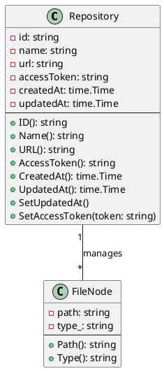

# ドメインモデル設計見直し用チェックシート（修正版）

| チェック項目                      | 対象ファイル                                                                               | 内容                                       | 修正要否 | 備考 |
| :-------------------------------- | :----------------------------------------------------------------------------------------- | :----------------------------------------- | :------- | :--- |
| 1. ADR設計方針との整合性          | adr/0007-backend-architecture-onion.md                                                     | Onionアーキテクチャ・依存関係              |          |      |
| 2. DBスキーマとの整合性           | adr/0005-database-schema.md<br>adr/0004-database-specification.md                          | Repository構成・フィールド                 |          |      |
| 3. 外部仕様との整合性             | adr/0001-external-repository-markdown-structure.md<br>adr/0002-repository-access-method.md | Markdown構造・アクセス方式                 |          |      |
| 4. Entity定義の妥当性・修正要否   | backend/domain/model/repository.go<br>backend/domain/model/file_node.go                    | Entity/ValueObject設計（属性・責務・関係） |          |      |
| 5. Domain Serviceの有無・設計     | backend/domain/model/（未実装の場合は新規追加検討）                                        | 業務ロジックの分離・設計                   |          |      |
| 6. モデルテストの網羅性           | backend/domain/model/file_node_test.go<br>backend/domain/model/repository_test.go          | Factory/Getter/再構築テスト                |          |      |
| 7. 永続化インターフェースの整合性 | backend/domain/repository/repository.go                                                    | Repositoryインターフェース                 |          |      |
| 8. ファイル分割・責務分離         | adr/0011-backend-file-splitting-strategy.md                                                | モデル/リポジトリ/サービス分割             |          |      |
| 9. API定義との整合性              | adr/0010-api-definition-generation-specification.md                                        | API仕様・DTO設計                           |          |      |

---

- Entity（モデル）定義の妥当性・修正要否を明示的にチェック項目へ追加しました。
- Domain Serviceの有無・設計も明記しています。
- 設計・実装変更時は各項目を確認し、修正要否・対応状況を記入してください。

---

## 現状ドメインモデル構成（2025/11/03時点）

### Repository（リポジトリ）

- 属性
  - id: string（UUID等、ユニークID）
  - name: string（リポジトリ名）
  - url: string（GitリポジトリURL）
  - accessToken: string（アクセストークン）
  - createdAt: time.Time（登録日時）
  - updatedAt: time.Time（更新日時）
- メソッド
  - ID(), Name(), URL(), AccessToken(), CreatedAt(), UpdatedAt(), SetUpdatedAt(), SetAccessToken(token)

### FileNode（ファイルノード）

- 属性
  - path: string（リポジトリルートからのパス）
  - type_: string（"file" or "dir"）
- メソッド
  - Path(), Type()

### 関連

- Repositoryは複数のFileNode（管理対象ファイル/ディレクトリ）を持つ可能性あり
- Repository管理APIやDBスキーマ（`repository_configurations`）で関連付け

### インターフェース

- Repository（永続化用インターフェース）: Save, FindByURL, FindByID, FindAll, SaveManagedFiles, GetManagedFiles, UpdateAccessToken など

### 備考

- Domain Serviceは現状未実装
- ValueObject（ID等）は型として分離されていない（string型で実装）

---

## ドメインモデル図（Markdownベースの簡易図）

```
Repository
├─ id: string
├─ name: string
├─ url: string
├─ accessToken: string
├─ createdAt: time.Time
├─ updatedAt: time.Time
├─ [methods]
│    ├─ ID(), Name(), URL(), AccessToken(), CreatedAt(), UpdatedAt(), SetUpdatedAt(), SetAccessToken(token)
│
└─ manages → FileNode[*]
      ├─ path: string
      ├─ type_: string ("file" or "dir")
      ├─ [methods] Path(), Type()
```

---

## ドメインモデル図（PlantUML形式）

以下のPlantUMLコードはVS CodeのPlantUML拡張でプレビュー可能です。


